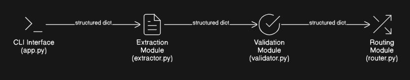

# Autonomous Insurance Claims Processing Agent (Lite)

## Executive Summary

This project implements a lightweight autonomous insurance claims routing engine.

It extracts structured data from FNOL documents (PDF/TXT), validates required fields, and applies deterministic business rules to route claims into Fast-track, Manual Review, Specialist Queue, or Investigation workflows.

The system emphasizes explainability, modular architecture, and rule-priority logic consistent with real-world insurance risk handling.

## 📌 Overview

This project implements a lightweight autonomous claims processing agent that:

- Extracts structured data from FNOL (First Notice of Loss) documents (PDF/TXT)
- Validates required and consistent fields
- Applies deterministic rule-based routing logic
- Outputs structured JSON responses
- Includes confidence scoring for decision transparency

The system is designed to demonstrate clarity of logic, modular architecture, and explainable decision-making.

## 🏗 System Architecture

```
FNOL Document (PDF/TXT)
  ↓
Text Extraction Layer
  ↓
Field Extraction Engine (Regex-based)
  ↓
Validation Engine (Missing + Consistency Checks)
  ↓
Routing Engine (Rule-Based + Confidence Scoring)
  ↓
Structured JSON Output (CLI)
```


### Processing Flow


## 🔷 Rule Priority & Decision Hierarchy

Routing rules are evaluated in the following order:

1. Missing mandatory fields → Manual Review
2. Data inconsistencies → Manual Review
3. Fraud indicators → Investigation Flag
4. Injury claims → Specialist Queue
5. Damage < 25,000 → Fast-track
6. Default → Manual Review

### Why Injury Overrides Fast-Track

Injury-related claims require specialized handling due to:

- Higher financial exposure
- Legal implications
- Medical documentation requirements
- Regulatory compliance considerations

Even if the estimated damage is below the fast-track threshold, injury claims are routed to a specialist queue. This reflects real-world insurance workflows where risk classification overrides cost thresholds.

### Routing Decision Tree


## 🔷 Confidence Scoring Strategy

Confidence is derived deterministically from rule certainty:

| Scenario              | Confidence |
| --------------------- | ---------- |
| Missing fields        | 0.60       |
| Data inconsistencies  | 0.65       |
| Fraud keyword match   | 0.85       |
| Injury claim          | 0.90       |
| Fast-track eligible   | 0.92       |
| Default manual review | 0.75       |

This ensures:

- Explainability
- Auditability
- Deterministic behavior
- No black-box decisions

## 🔷 Design Decisions

### Why Rule-Based Instead of Machine Learning?

- The routing criteria are explicitly defined
- The decision space is small and deterministic
- Explainability is prioritized over probabilistic modeling
- Easier debugging and auditability

In a production setting, ML could augment:

- Fraud risk scoring
- Severity estimation
- NLP-based semantic extraction

However, for this lite implementation, a rule engine provides clarity and transparency.

### Why Modular Architecture?

The system is divided into clear modules:

- `extractor.py` → Document ingestion & structured field parsing
- `validator.py` → Missing field detection & consistency checks
- `router.py` → Business rule evaluation & confidence scoring
- `app.py` → CLI orchestration & JSON output

**Benefits:**

- Separation of concerns
- Easier maintenance
- Testability
- Extensibility

### Component Interaction



## 🧪 Test Scenarios

### 1️⃣ Injury Case

```bash
python app.py sample_docs/FNOL_Injury_Case.pdf
```

**Expected Route:** Specialist Queue

### 2️⃣ Fraud Case

```bash
python app.py sample_docs/FNOL_Fraud_Case.pdf
```

**Expected Route:** Investigation Flag

### 3️⃣ Fast-Track Case

```bash
python app.py sample_docs/FNOL_FastTrack_Case.pdf
```

**Expected Route:** Fast-track

## 🚀 How to Run

**Create virtual environment:**

```bash
python -m venv venv
source venv/Scripts/activate   # Windows Git Bash
```

**Install dependencies:**

```bash
pip install -r requirements.txt
```

**Run:**

```bash
python app.py <file_path>
```

**Example:**

```bash
python app.py sample_docs/FNOL_Fraud_Case.pdf
```

## 🔮 Future Enhancements

- Replace regex extraction with structured LLM parsing
- Add ML-based fraud probability scoring
- Integrate OCR for scanned PDFs
- Add REST API layer
- Add structured logging for audit compliance

## 🧠 System Characteristics

- Deterministic
- Explainable
- Modular
- CLI-driven
- JSON-based
- Easily extensible
